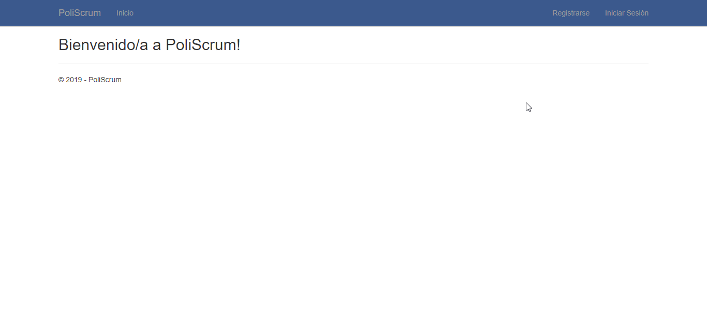

# FP-UNA Ingeniería de Software II
Repositorio para trabajos de la asignatura Ingeniería de Software II de la FP-UNA.

## PoliScrum
Sistema de Gestión de Proyectos Scrum

### Integrantes
* Fátima Almada
* Oscar Armoa
* Liz Garay
* Javier Meza

### Definición de Arquitectura y Framework

### Pantalla de Login v1

### ABM de Proyectos
